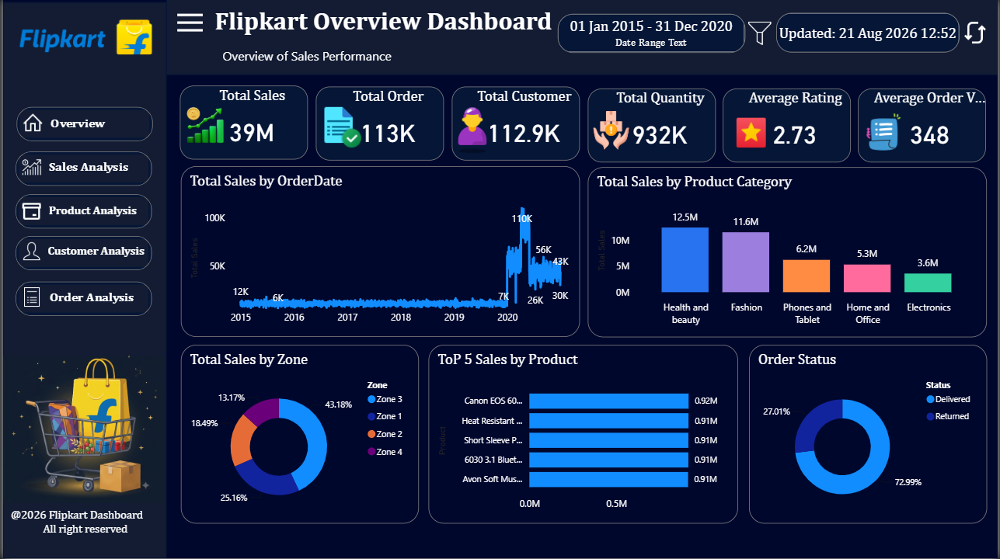
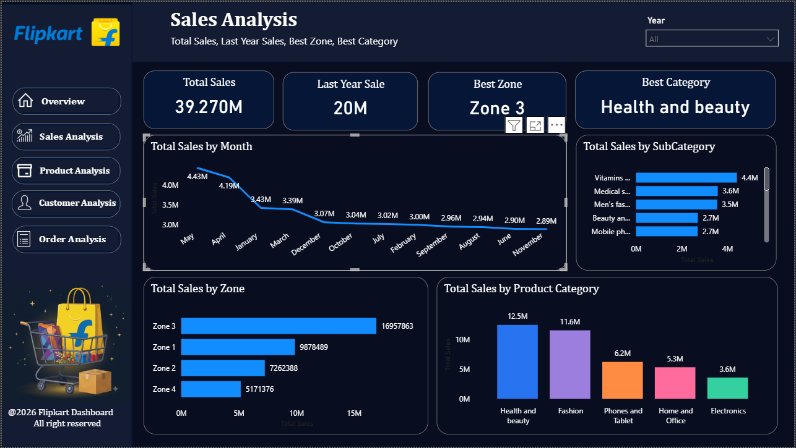
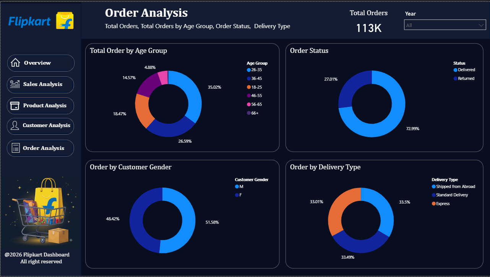
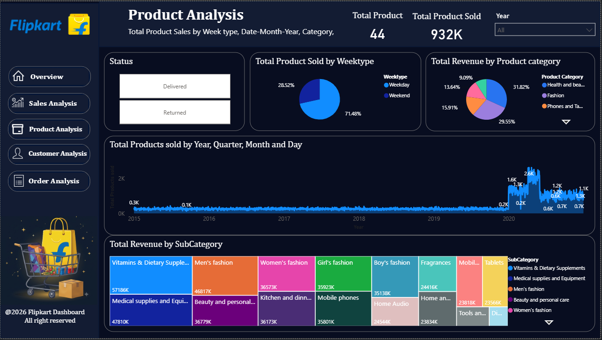
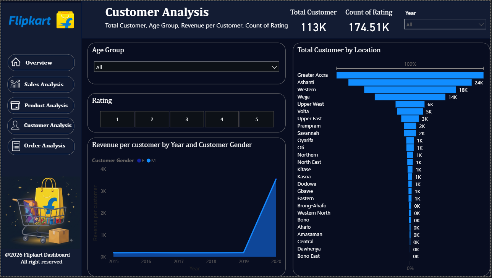

# 🛒 Flipkart Sales Dashboard — Power BI Project

An interactive **Power BI dashboard** built to analyse Flipkart's e-commerce sales, orders, products, and customer data across multiple report pages — designed to give business stakeholders a 360° view of performance and support data-driven decisions.


---

## 📌 Project Overview

This dashboard consolidates raw e-commerce transactional data into a single, filterable Power BI report. It follows a clean **snowflake-schema data model** (one Fact table + multiple Dimension tables) and uses **DAX measures** to power KPIs, trends, and interactive visuals across 8 report pages.

**File:** `Flipkart_Sales_Dashboard.pbix`

---

## 🎯 Objective

- Track overall sales, orders, revenue, and profit performance over time
- Analyse performance by product, category, and sub-category
- Understand order fulfilment — status, delivery type, and volume trends
- Profile customers by zone, age group, gender, and location
- Enable self-service, filterable exploration via slicers, drill-downs, and drill-through

---

## 🛠️ Tools & Technology Used

| Tool | Purpose |
|---|---|
| **Microsoft Power BI Desktop** | Report authoring & visualisation |
| **Power Query** | Data extraction, cleaning & transformation |
| **Data Modelling** | Snowflake schema (Fact + Dimension tables) |
| **DAX** | Measures for KPIs and dynamic calculations |

---

## 🗂️ Data Model

| Table | Type | Description |
|---|---|---|
| `Fact-Ecommerce` | Fact | Central transactional table — Order Status, Rating, etc. |
| `Dim-order` | Dimension | Order Date, Delivery Type |
| `Dim-Calender` | Dimension | Year, Month, Weektype, Date Hierarchy |
| `Dim-Product` | Dimension | Product master |
| `Dim-Category` | Dimension | Product Category master |
| `Dim-Subcategory` | Dimension | Product Sub-Category master |
| `Dim-Customer` | Dimension | Zone, Age Group, Gender, Location |
| `Measure` | Measures table | All DAX measures used in the report |

---

## 📊 Report Pages

| # | Page | What it shows |
|---|---|---|
| 1 | **Cover Page** | Landing page with branding & navigation |
| 2 | **Overview** | Executive KPI summary — Sales, Orders, Customers, Rating, AOV |
| 3 | **Sales** | Sales trends by month, category, zone & sub-category |
| 4 | **Orders** | Order volume by age group, status, gender & delivery type |
| 5 | **Product** | Product performance, revenue by category/sub-category |
| 6 | **Customer** | Customer demographics, location funnel, revenue per customer |
| 7 | **Drill Through** | Right-click drill-through to a detailed, zone-filtered customer table |
| 8 | **Product Tooltip** | Hidden tooltip page — Top 3 profitable products on hover |

---

## 📈 Key Measures (DAX)

`Total Sales` · `Total Order` · `Total Customer` · `Average Rating` · `Total Quantity` · `Average Order Value` · `Best Zone` · `Best Category` · `Total Products` · `Total Products sold` · `Total Revenue` · `Total Profit` · `Revenue per customer` · `Data Refreshed On`

---

## ✨ Interactivity Features

- 🔍 Global & page-level **Year slicers**
- 👥 **Age Group** & **Rating** slicers on the Customer page
- 🖱️ Custom **navigation buttons** on every page
- 💬 Hidden **tooltip page** for extra product detail on hover
- 🖱️➡️ **Drill-through** page for zone-filtered customer detail (right-click any Zone chart)
- 📅 Drill-down date hierarchies (Day → Month → Quarter → Year)
- 🔗 Cross-filtering across all visuals on a page

---

## 🖼️ Dashboard Preview

> Add your dashboard screenshots below (place image files in a `screenshots/` folder and update the paths).

| Overview | Sales |
|---|---|
|  |  |

| Orders | Product |
|---|---|
|  |  |

| Customer |
|---|---|
|  |

---

## 💡 Key Business Insights Enabled

- Overall sales, order & revenue trend over time
- Best-performing zone and product category at a glance
- Category / sub-category level revenue contribution
- Order fulfilment breakdown by status and delivery type
- Customer distribution by zone, age group, gender & location
- Top 3 most profitable products
- Weekday vs. weekend product sales pattern

---

## 📂 Repository Structure

```
Flipkart-Sales-Dashboard/
├── README.md
├── Flipkart_Sales_Dashboard.pbix
├── Flipkart_Sales_Dashboard_Documentation.docx
└── screenshots/
    ├── overview.png
    ├── sales.png
    ├── orders.png
    ├── product.png
    ├── customer.png
    └── drill_through.png
```

---

## 🚀 How to Use

1. Clone/download this repository
2. Open `Flipkart_Sales_Dashboard.pbix` in **Power BI Desktop**
3. Explore each page using the navigation buttons
4. Use the **Year / Age Group / Rating** slicers to filter data
5. Right-click any **Zone** chart to try the drill-through page

---

## 👤 Author

**Akash Kumar Singh**

---

⭐ If you found this project useful, consider giving it a star!
